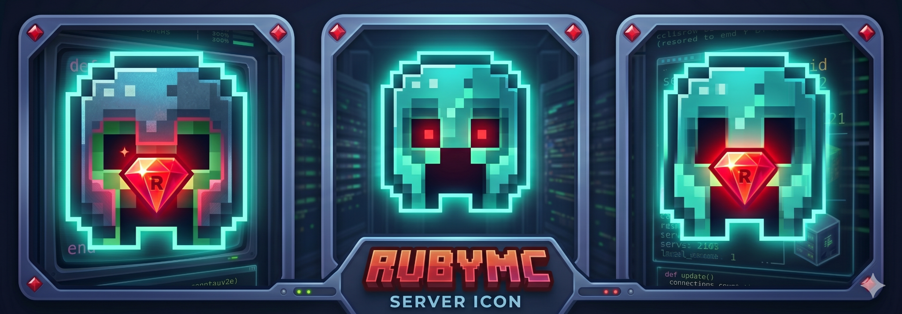

# 💎 RubyMC Launcher — Minecraft Ruby Launcher

> Launcher para **Minecraft Java Edition** feito em **Ruby**, com interface Web local, tema RubyMC Neon, modo clássico via terminal, autenticação Microsoft, modo offline, modpacks, servidor público da comunidade, integração com Discord e comando único de execução.



---

## 📌 Visão geral

O **RubyMC Launcher** é um launcher personalizado para Minecraft Java Edition desenvolvido em Ruby.

O projeto começou como um launcher terminal em Ruby puro e evoluiu para um sistema com:

- launcher clássico via terminal;
- launcher Web local com CSS real;
- comando único `./rubymc`;
- display interno para logs, testes e ações;
- suporte inicial a modpacks;
- integração com servidor público da comunidade;
- integração com Discord Rich Presence e bot de convites;
- organização de raiz do projeto;
- scripts de manutenção, teste e diagnóstico.

A interface Web roda localmente em:

```text
http://127.0.0.1:4567
```

O comando recomendado para iniciar tudo é:

```bash
./rubymc
```

---

## ⚠️ Aviso importante

Este projeto **não é oficial da Mojang, Microsoft ou Discord**.

Ele é um launcher comunitário/pessoal para estudo, automação e integração com Minecraft Java Edition.

Use com responsabilidade, mantenha tokens e credenciais privados, e não publique arquivos sensíveis como:

```text
config/settings.yml
~/.minecraft_ruby_launcher/accounts.json
~/.minecraft_ruby_launcher/discord_invites.json
.env
```

---

## ✅ Status atual do projeto

| Área | Status |
|---|---|
| Launcher clássico terminal | ✅ Funcional |
| Login Microsoft Device Code Flow | ✅ Implementado no projeto base |
| Modo offline | ✅ Implementado |
| Download de Minecraft/libraries/assets | ✅ Implementado no projeto base |
| Discord Rich Presence | ✅ Implementado no projeto base |
| Bot Discord de convites | ✅ Implementado/ajustável |
| Launcher Web local | ✅ Implementado |
| Tema RubyMC Neon | ✅ Implementado via CSS |
| Display interno de logs/testes | ✅ Implementado |
| Comando único `./rubymc` | ✅ Implementado |
| Organização da raiz | ✅ Script disponível |
| Modpacks `.mrpack`/Modrinth | 🟡 Suporte inicial |
| Modpacks CurseForge | 🟡 Importação parcial/estrutura pendente |
| Servidor público da comunidade | 🟡 Configurável |
| Instalador final `.deb`/`.AppImage` | 🔵 Planejado |

Legenda:

```text
✅ pronto
🟡 funcional/parcial, pode exigir ajuste
🔵 planejado
```

---

## 🧱 Estrutura recomendada do projeto

A raiz deve ficar limpa, com apenas os arquivos principais:

```text
MinecraftLauncher/
├── bin/
│   └── rubymc
├── config/
│   ├── settings.yml
│   └── config.rb
├── docs/
│   ├── WEB_LAUNCHER_FUNCTIONAL_FIX.md
│   ├── WEB_LAUNCHER_ORGANIZACAO.md
│   ├── TEMA_RUBYMC_NEON.md
│   └── INTEGRACAO_MODPACKS_GUI.md
├── lib/
│   ├── account_bank.rb
│   ├── auto_updater.rb
│   ├── community_server.rb
│   ├── discord_integration.rb
│   ├── launcher_cli.rb
│   ├── launcher_extensions.rb
│   ├── microsoft_auth.rb
│   ├── minecraft_manager.rb
│   ├── modpack_manager.rb
│   ├── session_manager.rb
│   └── web_launcher_app.rb
├── scripts/
│   ├── organize_project_root.rb
│   ├── setup_channels.rb
│   ├── setup_discord_forum.rb
│   └── setup_discord_welcome.rb
├── test/
│   ├── test_discord_bot.rb
│   └── test_discord_invite.rb
├── tmp/
│   └── rubymc/
│       ├── web.pid
│       └── web.log
├── vendor/
│   └── bundle/
├── web/
│   ├── index.html
│   └── assets/
│       ├── css/
│       │   └── launcher.css
│       ├── img/
│       │   ├── rubymc-control-panel.png
│       │   ├── rubymc-discord-bot-icon.png
│       │   ├── rubymc-discord-overlay.png
│       │   ├── rubymc-discord-panel.png
│       │   ├── rubymc-server-icon.png
│       │   ├── rubymc-server-large.png
│       │   └── rubymc-server-strip.png
│       └── js/
│           └── launcher.js
├── bot_daemon.rb
├── Gemfile
├── Gemfile.lock
├── launcher.rb
├── launcher_gui.rb
├── README.md
├── rubymc
└── .gitignore
```

---

## 🚀 Início rápido

### 1. Entrar na pasta do projeto

```bash
cd ~/RubymineProjects/MinecraftLauncher
```

### 2. Dar permissão ao comando principal

```bash
chmod +x rubymc bin/rubymc
```

### 3. Iniciar o launcher

```bash
./rubymc
```

### 4. Abrir no navegador

O comando tenta abrir automaticamente, mas você também pode acessar manualmente:

```text
http://127.0.0.1:4567
```

---

## 🧠 Comando único `./rubymc`

O arquivo `rubymc` é o comando principal do projeto.

Ele centraliza:

- verificação do `Gemfile`;
- instalação de dependências;
- correção de gems conflitantes;
- liberação da porta `4567`;
- inicialização do servidor Web;
- abertura do navegador;
- logs;
- testes;
- modo clássico;
- organização da raiz.

### Comandos disponíveis

```bash
./rubymc
```

Inicia o launcher Web.

```bash
./rubymc start
```

Também inicia o launcher Web.

```bash
./rubymc stop
```

Para o servidor Web local.

```bash
./rubymc restart
```

Para e inicia novamente.

```bash
./rubymc status
```

Mostra status, PID e porta usada.

```bash
./rubymc logs
```

Mostra os logs em tempo real.

```bash
./rubymc test
```

Executa testes básicos de sintaxe e dependências.

```bash
./rubymc classic
```

Abre o launcher clássico no terminal.

```bash
./rubymc organize
```

Organiza a raiz do projeto usando o script de organização.

---

## 🖥️ Launcher Web

O launcher Web é iniciado por:

```bash
./rubymc
```

ou diretamente por:

```bash
bundle exec ruby launcher_gui.rb
```

O recomendado é usar sempre:

```bash
./rubymc
```

A interface Web roda em:

```text
http://127.0.0.1:4567
```

### Arquivos principais da interface Web

```text
launcher_gui.rb
lib/web_launcher_app.rb
web/index.html
web/assets/css/launcher.css
web/assets/js/launcher.js
web/assets/img/
```

### Responsabilidade de cada arquivo

| Arquivo | Função |
|---|---|
| `launcher_gui.rb` | Ponto de entrada do launcher Web |
| `lib/web_launcher_app.rb` | Backend Web em Ruby/WEBrick |
| `web/index.html` | Estrutura visual da página |
| `web/assets/css/launcher.css` | Tema visual RubyMC Neon |
| `web/assets/js/launcher.js` | Comunicação com backend, botões e display |
| `web/assets/img/` | Imagens do tema |

---

## 🎨 Tema RubyMC Neon

O tema visual foi pensado para seguir um estilo:

```text
Minecraft + Ruby + Neon + painel futurista + servidor de comunidade
```

Características:

- fundo escuro;
- destaque em vermelho/rubi;
- detalhes em ciano neon;
- cards com brilho;
- display interno estilo terminal;
- imagens customizadas em `web/assets/img/`;
- layout organizado por painéis e abas.

### Editar CSS

Arquivo principal:

```text
web/assets/css/launcher.css
```

Depois de editar, reinicie:

```bash
./rubymc restart
```

E force atualização no navegador:

```text
Ctrl + F5
```

ou acesse com parâmetro novo:

```text
http://127.0.0.1:4567/?v=novo-tema
```

---

## 📺 Display interno

O launcher Web possui um display interno para mostrar:

- status do sistema;
- logs;
- testes;
- erros;
- comandos executados;
- ações de botões;
- resposta do backend;
- processos iniciados;
- status do servidor;
- resultado de importação de modpacks.

Exemplo de saída:

```text
[22:02:46] SYSTEM  Display limpo. Aguardando novos eventos...
[22:02:49] ACTION  Launcher clássico iniciado...
[22:02:49] COMMAND $ /usr/bin/ruby3.2 launcher.rb
```

### Observação importante

O `launcher.rb` clássico é interativo. Por isso, quando aberto pelo launcher Web, o ideal é que ele rode em terminal externo ou via comando:

```bash
./rubymc classic
```

---

## 🕹️ Launcher clássico

O launcher clássico é o modo terminal original.

Execute com:

```bash
bundle exec ruby launcher.rb
```

ou:

```bash
./rubymc classic
```

Ele permite:

- escolher versão do Minecraft;
- baixar versão;
- selecionar login Microsoft;
- jogar offline;
- definir username;
- configurar RAM;
- iniciar Minecraft.

Exemplo do menu:

```text
╔════════════════════════════════════════════════╗
║            MINECRAFT RUBY LAUNCHER             ║
║            Versão 1.0.0 — Puro Ruby            ║
╚════════════════════════════════════════════════╝

Escolha a versão do Minecraft que deseja jogar:
  ❯ 1.21.4 (Instalada localmente)
    ✨ Baixar última versão estável oficial
    🔍 Digitar uma versão específica

Como você deseja entrar no jogo?
  ❯ 🔑 Adicionar nova conta Microsoft (Online)
    🔌 Jogar Offline (Sem conta / Pirata)
```

---

## 🔐 Login Microsoft

O projeto base possui autenticação Microsoft por **OAuth 2.0 Device Code Flow**.

Fluxo:

1. O usuário escolhe login Microsoft.
2. O launcher exibe um código.
3. O usuário acessa a página indicada.
4. Digita o código.
5. O launcher autentica via Microsoft/Xbox/XSTS/Minecraft.
6. A conta é salva localmente.
7. Em execuções futuras, o token é renovado automaticamente quando possível.

Arquivo responsável:

```text
lib/microsoft_auth.rb
```

As contas ficam salvas em:

```text
~/.minecraft_ruby_launcher/accounts.json
```

Permissão recomendada:

```bash
chmod 600 ~/.minecraft_ruby_launcher/accounts.json
```

---

## 🔌 Modo offline

O modo offline permite iniciar o Minecraft sem autenticação Microsoft.

Ele solicita apenas um username:

```text
Digite o apelido (Username) para o jogo: Victor
```

Uso recomendado:

- testes locais;
- desenvolvimento;
- ambientes sem internet;
- servidores que aceitam modo offline.

Atenção: servidores oficiais/online-mode exigem conta autenticada.

---

## 🧩 Modpacks

O projeto possui suporte inicial a modpacks.

Arquivos relacionados:

```text
lib/modpack_manager.rb
lib/launcher_extensions.rb
docs/INTEGRACAO_MODPACKS_GUI.md
```

### Suporte planejado/implementado

| Formato | Status |
|---|---|
| `.mrpack` Modrinth | 🟡 Suporte inicial |
| CurseForge zip | 🟡 Estrutura parcial |
| Overrides | 🟡 Suporte inicial |
| Download automático de mods | 🟡 Depende do manifesto |
| Verificação SHA1 | 🟡 Quando disponível no manifesto |

### Pastas recomendadas

```text
~/.minecraft_ruby_launcher/modpacks/
~/.minecraft_ruby_launcher/instances/
```

### Fluxo esperado

1. Usuário seleciona um `.mrpack`.
2. O launcher lê o manifesto.
3. Cria uma instância local.
4. Baixa arquivos quando houver URLs no manifesto.
5. Aplica overrides.
6. Configura versão/loader.
7. Disponibiliza a instância para jogar.

---

## 🌍 Servidor público da comunidade

O launcher possui área para servidor público/comunidade.

Arquivo relacionado:

```text
lib/community_server.rb
```

Configuração sugerida em `config/settings.yml`:

```yaml
community_server:
  enabled: true
  name: "RubyMC Community"
  address: "play.seuservidor.com"
  port: 25565
  version: "1.21.4"
  description: "Servidor público da comunidade RubyMC"
  discord_invite: "https://discord.gg/SEU_CONVITE"
```

### Funcionalidades esperadas

- mostrar endereço do servidor;
- copiar IP;
- testar conexão;
- abrir Minecraft apontando para o servidor;
- exibir status no display;
- integrar convite Discord.

---

## 🤖 Discord Rich Presence

O launcher pode mostrar no Discord que o usuário está jogando Minecraft.

Arquivo relacionado:

```text
lib/discord_integration.rb
```

Configuração:

```yaml
discord:
  rich_presence: true
  client_id: "SEU_DISCORD_CLIENT_ID"
```

Requisitos:

- criar uma aplicação no Discord Developer Portal;
- copiar o Application ID;
- deixar o cliente Discord aberto na máquina.

---

## 📩 Bot Discord de convites

O bot Discord pode criar convites e enviar por DM ao jogador.

Configuração sugerida:

```yaml
discord:
  bot_enabled: true
  bot_token: "SEU_BOT_TOKEN"
  invite_channel_id: "ID_DO_CANAL"
  invite_max_age_seconds: 86400
  invite_max_uses: 1
  invite_store_path: "~/.minecraft_ruby_launcher/discord_invites.json"
  server_address: "play.seuservidor.com:25565"
```

Executar daemon:

```bash
bundle exec ruby bot_daemon.rb
```

ou:

```bash
./rubymc bot
```

se esse subcomando estiver presente no seu script.

### Permissões necessárias do bot

- criar convite;
- enviar mensagens;
- ler canais;
- enviar DM quando possível;
- visualizar membros, se necessário.

---

## ⚙️ Configuração completa

Arquivo principal:

```text
config/settings.yml
```

Exemplo completo:

```yaml
launcher:
  version: "1.0.0"
  name: "RubyMC Launcher"
  update_url: "https://api.github.com/repos/SEU_USUARIO/SEU_REPO/releases/latest"

minecraft:
  default_version: "1.21.4"
  ram_mb: 2048
  java_path: ""
  game_dir: "~/.minecraft"
  launcher_dir: "~/.minecraft_ruby_launcher"

web:
  host: "127.0.0.1"
  port: 4567
  auto_open_browser: true
  theme: "rubymc-neon"

community_server:
  enabled: true
  name: "RubyMC Community"
  address: "play.seuservidor.com"
  port: 25565
  version: "1.21.4"
  description: "Servidor público da comunidade RubyMC"
  discord_invite: "https://discord.gg/SEU_CONVITE"

discord:
  rich_presence: true
  client_id: "SEU_DISCORD_CLIENT_ID"
  bot_enabled: false
  bot_token: "SEU_BOT_TOKEN"
  invite_channel_id: "ID_DO_CANAL"
  invite_max_age_seconds: 86400
  invite_max_uses: 1
  invite_store_path: "~/.minecraft_ruby_launcher/discord_invites.json"
  server_address: "play.seuservidor.com:25565"

modpacks:
  enabled: true
  install_dir: "~/.minecraft_ruby_launcher/modpacks"
  instances_dir: "~/.minecraft_ruby_launcher/instances"
```

---

## 💎 Gemfile recomendado

O projeto Web não deve depender mais de Tk/Glimmer.

Evite:

```ruby
gem "glimmer-dsl-tk"
gem "glimmer-dsl-libui"
```

Gemfile recomendado:

```ruby
source "https://rubygems.org"

gem "httparty", "~> 0.24"
gem "tty-prompt"
gem "tty-spinner"
gem "tty-box"
gem "pastel"
gem "json"
gem "rubyzip", "~> 2.3"
gem "webrick", "~> 1.9"
```

Depois de alterar:

```bash
rm -f Gemfile.lock
bundle install
```

---

## ☕ Java e compatibilidade

Minecraft moderno exige versões específicas de Java.

| Minecraft | Java recomendado |
|---|---|
| 1.21.x | Java 21 |
| 1.20.x | Java 17 ou 21 |
| 1.18–1.19 | Java 17 |
| 1.17 | Java 16 |
| 1.16 ou menor | Java 8 |

Verificar Java:

```bash
java -version
which java
```

Configurar Java no Ubuntu:

```bash
sudo update-alternatives --config java
```

Configurar caminho manual em `config/settings.yml`:

```yaml
minecraft:
  java_path: "/usr/lib/jvm/java-21-openjdk-amd64/bin/java"
```

---

## 🧨 Erro: UnsupportedClassVersionError

Erro exemplo:

```text
UnsupportedClassVersionError:
Main has been compiled by a more recent version of the Java Runtime
class file version 69.0
this version only recognizes class file versions up to 65.0
```

Significado:

```text
O Minecraft/mod/loader foi compilado para Java mais novo
do que o Java usado para iniciar o jogo.
```

Solução:

1. Verificar versão do Java:

```bash
java -version
```

2. Instalar Java adequado.
3. Selecionar versão correta do Minecraft.
4. Remover versões suspeitas em:

```text
~/.minecraft/versions/
```

Exemplo:

```bash
rm -rf ~/.minecraft/versions/26.1.2
```

Use uma versão oficial estável, como:

```text
1.21.4
```

---

## 🧯 Solução de problemas

### Porta 4567 ocupada

Erro:

```text
Address already in use - bind(2) for 127.0.0.1:4567
```

Resolver:

```bash
./rubymc stop
```

ou:

```bash
sudo fuser -k 4567/tcp
```

Verificar:

```bash
sudo lsof -nP -iTCP:4567 -sTCP:LISTEN
```

---

### Display fica em “Conectando display...”

Soluções:

```bash
./rubymc restart
```

Depois:

```text
Ctrl + F5
```

ou acesse:

```text
http://127.0.0.1:4567/?v=novo
```

---

### CSS não atualiza

Forçar cache:

```text
Ctrl + F5
```

Remover CSS antigo e aplicar de novo:

```bash
rm -f web/assets/css/launcher.css
cp -rf rubymc_clean_web_theme_patch/* .
./rubymc restart
```

---

### Gemfile com `webrick` duplicado

Erro:

```text
You cannot specify the same gem twice with different version requirements.
```

Resolver:

```bash
sed -i '/webrick/d' Gemfile
printf '\ngem "webrick", "~> 1.9"\n' >> Gemfile
rm -f Gemfile.lock
bundle install
```

---

### Tk/Glimmer quebrando no Ubuntu

Erro típico:

```text
Can't find "tcl.h".
Can't find "tk.h".
At present, Tcl/Tk8.6 is not supported.
```

Solução atual do projeto:

```text
Não usar glimmer-dsl-tk.
Usar interface Web local com WEBrick.
```

Remova do Gemfile:

```ruby
gem "glimmer-dsl-tk"
gem "glimmer-dsl-libui"
```

---

### `./rubymc` com erro de sintaxe

Recrie o arquivo `rubymc` com a versão limpa do script do projeto.

Depois:

```bash
chmod +x rubymc bin/rubymc
./rubymc restart
```

---

## 🧪 Testes

Rodar testes básicos:

```bash
./rubymc test
```

O teste deve verificar:

- sintaxe do `launcher_gui.rb`;
- sintaxe do `launcher.rb`;
- sintaxe do `lib/web_launcher_app.rb`;
- dependências com `bundle check`.

Também é possível rodar manualmente:

```bash
ruby -c launcher.rb
ruby -c launcher_gui.rb
ruby -c lib/web_launcher_app.rb
bundle check
```

---

## 🧹 Organizar raiz do projeto

Rodar:

```bash
./rubymc organize
```

ou:

```bash
ruby scripts/organize_project_root.rb --apply
```

Arquivos movidos:

```text
setup_channels.rb        -> scripts/setup_channels.rb
setup_discord_forum.rb   -> scripts/setup_discord_forum.rb
setup_discord_welcome.rb -> scripts/setup_discord_welcome.rb
test_discord_bot.rb      -> test/test_discord_bot.rb
test_discord_invite.rb   -> test/test_discord_invite.rb
PATCH_SUMMARY.md         -> docs/PATCH_SUMMARY.md
```

---

## 🔒 Segurança

Nunca envie para GitHub:

```text
accounts.json
discord_invites.json
.env
config/settings.local.yml
tokens
refresh_tokens
bot_token
client_secret
```

Adicione ao `.gitignore`:

```gitignore
vendor/bundle/
tmp/
log/
.env
*.log

.minecraft_ruby_launcher/
config/settings.local.yml

accounts.json
discord_invites.json

rubymc_*_patch/
minecraft_ruby_launcher_*_patch/
```

---

## 🧬 Arquitetura

Fluxo Web:

```text
./rubymc
   ↓
launcher_gui.rb
   ↓
lib/web_launcher_app.rb
   ↓
WEBrick local
   ↓
web/index.html
   ↓
web/assets/js/launcher.js
   ↓
web/assets/css/launcher.css
```

Fluxo clássico:

```text
./rubymc classic
   ↓
launcher.rb
   ↓
lib/launcher_cli.rb
   ↓
lib/minecraft_manager.rb
   ↓
Minecraft Java Edition
```

Fluxo de autenticação:

```text
launcher_cli.rb
   ↓
microsoft_auth.rb
   ↓
Microsoft OAuth
   ↓
Xbox Live
   ↓
XSTS
   ↓
Minecraft profile
   ↓
account_bank.rb
```

Fluxo Discord:

```text
launcher.rb / launcher_gui.rb
   ↓
discord_integration.rb
   ↓
Discord Rich Presence / Bot
   ↓
bot_daemon.rb
```

---

## 📁 Diretórios de dados

Dados locais do launcher:

```text
~/.minecraft_ruby_launcher/
```

Possíveis arquivos:

```text
accounts.json
discord_invites.json
modpacks/
instances/
logs/
```

Minecraft padrão:

```text
~/.minecraft/
```

Versões:

```text
~/.minecraft/versions/
```

Assets:

```text
~/.minecraft/assets/
```

Libraries:

```text
~/.minecraft/libraries/
```

---

## 🛠️ Desenvolvimento

### Rodar servidor Web manualmente

```bash
bundle exec ruby launcher_gui.rb
```

### Rodar clássico manualmente

```bash
bundle exec ruby launcher.rb
```

### Ver logs

```bash
./rubymc logs
```

### Ver status

```bash
./rubymc status
```

### Reiniciar tudo

```bash
./rubymc restart
```

---

## 🧭 Roadmap

Ideias futuras:

- instalador `.deb`;
- AppImage;
- auto-update completo da interface Web;
- seleção visual de versões;
- painel de instâncias;
- instalação completa de Fabric/Forge/Quilt;
- busca de modpacks Modrinth pela interface;
- importador CurseForge completo;
- status real do servidor por ping Minecraft;
- login Microsoft direto pela interface Web;
- sistema de perfis;
- tela de configurações avançadas;
- empacotamento com ícone;
- logs persistentes por sessão;
- botão de reparo automático do Java;
- suporte a múltiplos servidores da comunidade.

---

## 🧾 Licença

MIT.

Você pode usar, modificar e distribuir este projeto, mantendo os créditos e respeitando os termos das APIs e serviços integrados.

---

## 💎 Créditos

Projeto desenvolvido como **RubyMC Launcher / Minecraft Ruby Launcher**.

Tecnologias principais:

- Ruby
- WEBrick
- HTML
- CSS
- JavaScript
- Minecraft Java Edition
- Microsoft OAuth
- Discord API
- RubyZip
- HTTParty

---

## ✅ Comando mais importante

Para usar o projeto no dia a dia:

```bash
cd ~/RubymineProjects/MinecraftLauncher
./rubymc
```

Para parar:

```bash
./rubymc stop
```

Para reiniciar:

```bash
./rubymc restart
```

Para logs:

```bash
./rubymc logs
```

