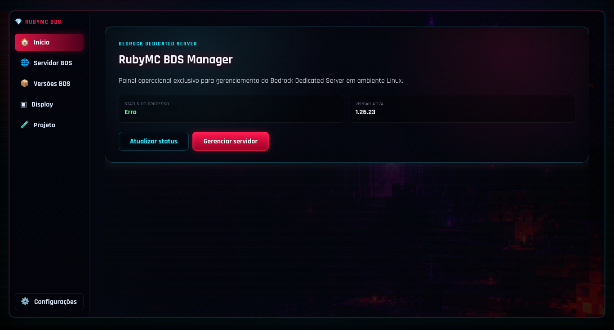
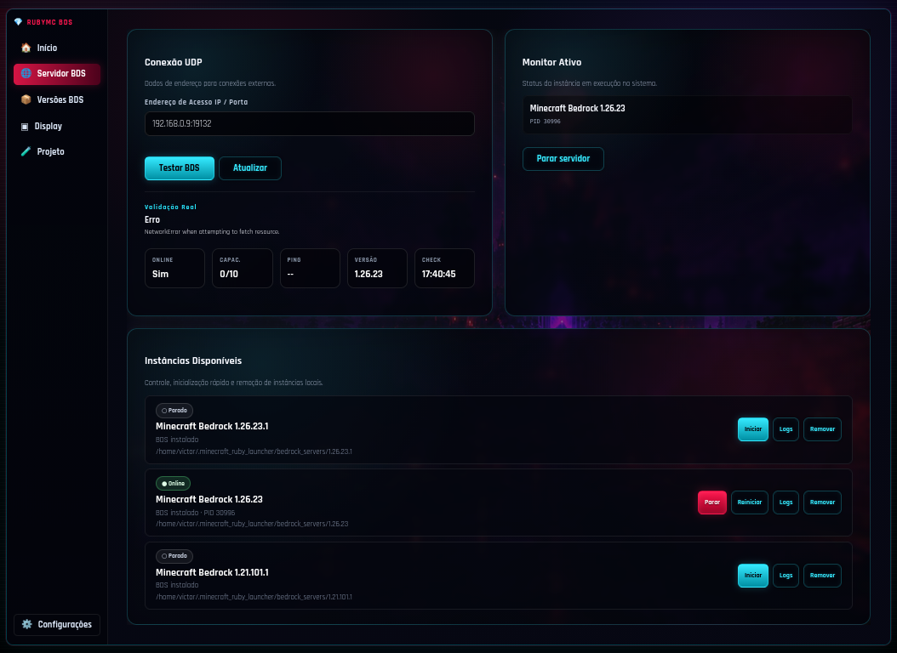
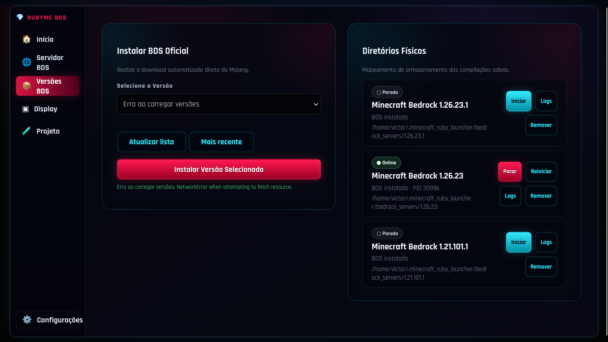
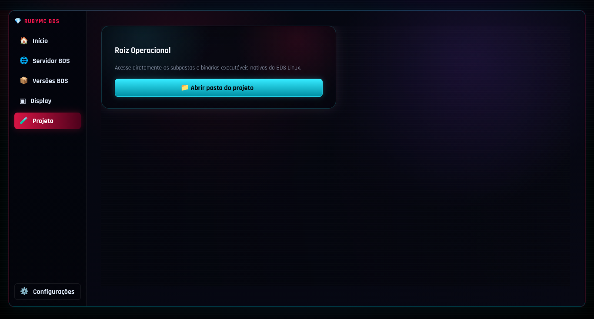
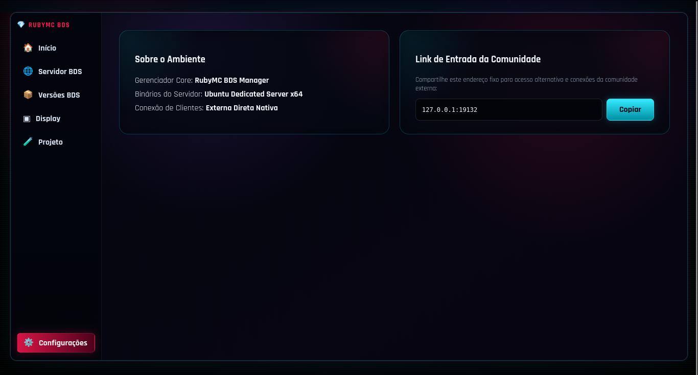

# 💎 RubyMC Bedrock BDS

<div align="center">


**Gerenciador visual para Minecraft Bedrock Dedicated Server com painel web, monitoramento UDP e controle de instâncias**

</div>

---

## 📸 Screenshots

<div align="center">

| 🏠 Início | 🌐 Servidor BDS |
|---|---|
|  |  |

| 📦 Versões BDS | 📜 Display |
|---|---|
|  |  |

| 📁 Projeto | ⚙️ Configurações |
|---|---|
|  |  |

</div>

---

## 🚀 Funcionalidades

### Painel Web

| Aba | Função |
|---|---|
| 🏠 **Início** | Dashboard com status geral e ações rápidas |
| 🌐 **Servidor BDS** | Monitoramento em tempo real (PID, ping, capacidade, versão) |
| 📦 **Versões BDS** | Download automático de versões oficiais Mojang |
| 📜 **Display** | Logs em tempo real do servidor |
| 📁 **Projeto** | Acesso ao diretório raiz e arquivos do ambiente |
| ⚙️ **Configurações** | IP, portas e informações do ambiente |

### Monitoramento

- **Status** online/offline com validação UDP
- **PID** ativo do processo BDS
- **Ping** do servidor
- **Capacidade** de jogadores
- **Versão ativa** do BDS
- **Horário** do último check

### Gerenciamento de Versões

- Download automático de versões oficiais Mojang
- Múltiplas versões instaladas simultaneamente
- Inicialização independente por versão
- Remoção de instâncias

### Controle de Instâncias

| Ação | Descrição |
|---|---|
| Iniciar | Sobe servidor BDS |
| Parar | Desliga servidor BDS |
| Reiniciar | Reinicia servidor BDS |
| Logs | Abre console de logs |
| Remover | Remove instância |

---

## 📋 Pré-requisitos

| Requisito | Verificação |
|---|---|
| **Ruby** 3.0+ | `ruby --version` |
| **Bundler** | `gem install bundler` |
| **Linux** (Ubuntu/Debian x64) | — |
| **BDS** | Download automático pelo painel |

---

## ⚙️ Instalação

```bash
# 1. Clone o repositório
git clone https://github.com/VICTORGG04/RubyMC-Launcher.git
cd RubyMC-Launcher/rubymc-bedrock

# 2. Instale as dependências Ruby
bundle install

# 3. Inicie o painel
./rubymc start
```

Acesse o painel em **http://127.0.0.1:4567**

---

## 💻 CLI Admin (`./rubymc`)

| Comando | Descrição |
|---|---|
| `./rubymc start` | Inicia painel web + monitor BDS |
| `./rubymc stop` | Para painel + servidores |
| `./rubymc restart` | Reinicia tudo |
| `./rubymc status` | Status do projeto |
| `./rubymc logs` | Logs do painel |
| `./rubymc server start` | Inicia servidor BDS |
| `./rubymc server stop` | Para servidor BDS |
| `./rubymc server restart` | Reinicia servidor BDS |
| `./rubymc server logs` | Logs do servidor BDS |

### Variáveis de Ambiente

| Variável | Padrão | Descrição |
|---|---|---|
| `RUBYMC_HOST` | `127.0.0.1` | Host do servidor web |
| `RUBYMC_PORT` | `4567` | Porta do servidor web |

---

## 🏗️ Estrutura do Projeto

```
rubymc-bedrock/
├── rubymc                   # CLI Admin (bash)
├── Gemfile                  # Dependências Ruby
├── Gemfile.lock
│
├── lib/                     # Módulos Ruby
├── config/                  # Configurações
├── web/                     # Frontend
│   ├── assets/
│   │   ├── css/
│   │   ├── js/
│   │   ├── backgrounds/
│   │   └── img/
│   └── views/
├── scripts/                 # Scripts auxiliares
├── bedrock_servers/         # Instâncias BDS (runtime)
├── logs/                    # Logs do servidor
├── tmp/                     # Runtime (gitignorado)
└── docs/
    └── assets/bedrock/      # Screenshots
```

---

## 🖥️ Interface

- **Visual neon** cyan/red com backgrounds cinematográficos
- **Layout** inspirado em RPG dark fantasy
- **Sidebar** moderna com efeitos glow
- **Painéis** responsivos e dark mode

---

## 🔒 Segurança

- ✅ **SSRF Protection** — downloads de URL bloqueiam IPs privados
- ✅ **Command Injection** — execução de comandos via array (`Open3.capture3`, `system` com args separados)
- ✅ **Rate Limiting** — limite de threads simultâneas
- ✅ **Scheme Validation** — downloads rejeitam protocolos não confiáveis

---

## 🗺️ Roadmap

### ✅ Atual
- [x] Gerenciamento de versões BDS (download + instalação)
- [x] Monitoramento UDP (PID, ping, capacidade)
- [x] Controle de instâncias (start/stop/restart/remove)
- [x] Display de logs em tempo real
- [x] Painel web dark neon
- [x] Proteções de segurança

### 🔜 Futuro
- [ ] Auto-update BDS
- [ ] Backup automático
- [ ] Integração IA local
- [ ] Painel multiusuário
- [ ] Gerenciamento remoto
- [ ] Suporte Docker

---

## 📄 Licença

Este projeto está licenciado sob a **MIT License** — consulte o arquivo [LICENSE](../LICENSE) para detalhes.

---

## 👨‍💻 Autor

Desenvolvido por **Victor Marcial**.
