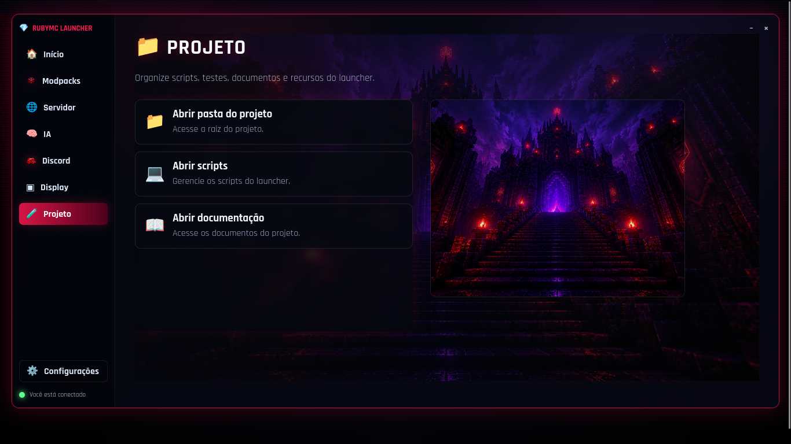
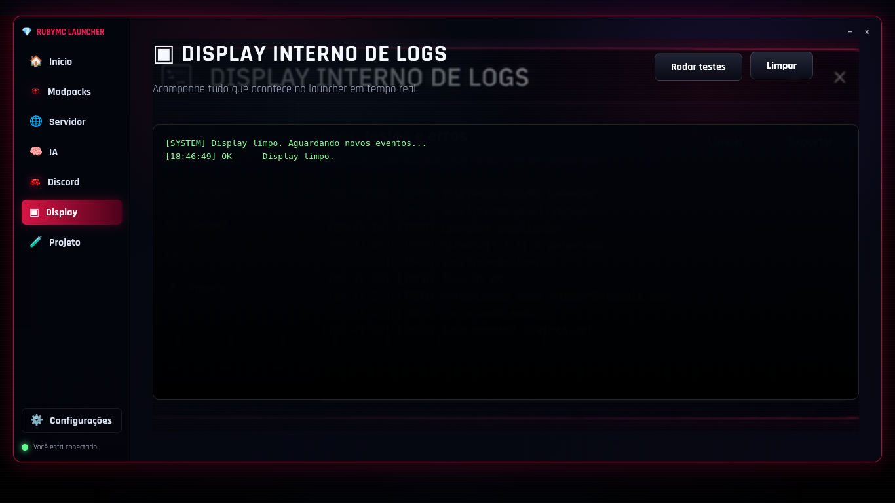
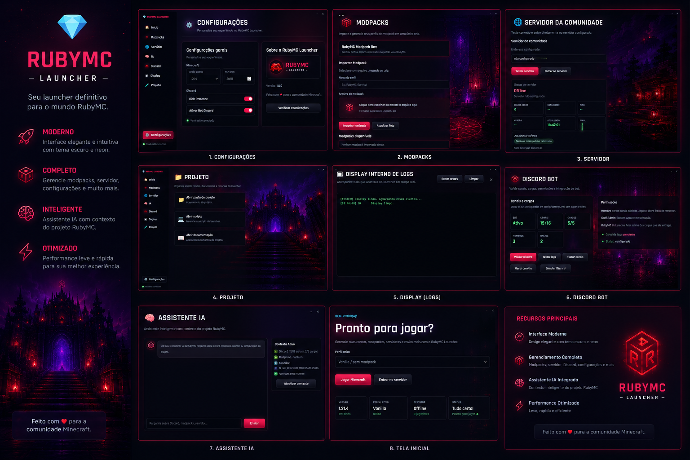

# 💎 RubyMC Launcher

<div align="center">


Launcher para **Minecraft Java Edition** em Ruby, com interface **Admin (Web)** e **Player (Terminal)**, integração com **Discord Bot**, **IA local via Ollama**, suporte a modpacks e servidor da comunidade.

</div>

---

## 🖼️ Screenshots

<div align="center">

| 🏠 Início | 📦 Modpacks |
|---|---|
|  |  |

| 🌐 Servidor | 💬 Discord |
|---|---|
|  |  |

| 🧠 IA | ⚙️ Configurações |
|---|---|
|  |  |

| 📁 Projeto | 📜 Display / Logs |
|---|---|
|  |  |

<br>

**🖼️ Painel Completo**



</div>

---

## 🚀 Como Usar

### 🖥️ Admin — Painel Web

| Comando | Descrição |
|---|---|
| `./rubymc start` | Inicia servidor web em `http://127.0.0.1:4567` |
| `./rubymc start --simulate` | Inicia com Discord mock e 20 jogadores simulados |
| `./rubymc stop` | Para servidor web + bot Discord |
| `./rubymc restart` | Reinicia ambos |
| `./rubymc status` | Status do servidor e do bot |
| `./rubymc logs` | Logs em tempo real |
| `./rubymc test` | Verifica sintaxe e dependências |
| `./rubymc ai "..."` | Pergunta à IA |
| `./rubymc ai-chat` | Chat interativo com IA |
| `./rubymc bot start\|stop\|logs` | Gerencia o bot Discord individualmente |

| Aba | Função |
|---|---|
| 🏠 **Início** | Status geral e ações rápidas |
| 📦 **Modpacks** | Importar/remover modpacks `.mrpack`/`.zip` |
| 🌐 **Servidor** | Status do servidor da comunidade (ao vivo) |
| 💬 **Discord** | Validar bot, canais, cargos, testar canais, gerar convites |
| 🧠 **IA** | Chat com IA local (Ollama) |
| 📋 **Projeto** | Informações e scripts do projeto |
| ⚙️ **Configurações** | Personalizar experiência |
| 📜 **Display** | Logs internos e ações do backend |

### 🎮 Player — Terminal

| Comando | Descrição |
|---|---|
| `bin/rubymc-player` | Menu interativo |
| `bin/rubymc-player play` | Abre o launcher para jogar |
| `bin/rubymc-player modpacks` | Lista/instala modpacks |
| `bin/rubymc-player server` | Status do servidor |
| `bin/rubymc-player discord` | Link do Discord |
| `bin/rubymc-player help` | Ajuda |

```bash
bin/rubymc-player        # Menu interativo
bin/rubymc-player play   # Direto ao jogo
bin/rubymc-player server # Status do servidor
```

### 🧠 Comandos da IA

A IA usa **Ollama** com modelo local (`qwen2.5:3b`). Não requer internet.

```bash
./rubymc ai "Qual a estrutura do projeto?"   # Pergunta única
./rubymc ai-chat                              # Chat interativo
```

Pelo painel web — Aba **🧠 IA** em `http://127.0.0.1:4567`.

---

## 📦 Funcionalidades

- **Autenticação Microsoft OAuth** — login real com conta Microsoft/Minecraft
- **Modo Offline** — jogar sem conta Microsoft (LAN/servidores offline)
- **Gerenciamento de Contas** — banco de múltiplas contas com renovação de token
- **Modpacks** — importação e remoção de `.mrpack` e `.zip` (Forge/Fabric/Quilt)
- **Servidor da Comunidade** — status em tempo real, MOTD, jogadores online
- **Discord Bot** — daemon WebSocket com boas-vindas automáticas, comandos, convites e cargos
- **Validação de Discord** — verifica bot, canais, cargos e logs pelo painel
- **IA Local** — assistente com contexto do projeto via Ollama
- **Rich Presence** — status do jogo no Discord em tempo real (IPC local)
- **Display Interno** — logs, testes e ações do backend no próprio painel

### 🎭 Simulação — 20 Jogadores

Para testar o painel com dados simulados:

```bash
# Terminal 1: Simulador de servidor Minecraft (20 jogadores online)
ruby bin/simulate_mc_players.rb

# Terminal 2: Launcher em modo simulação
RUBYMC_SIMULATE=1 ./rubymc start
```

Configure `config/settings.yml` com `server_address: localhost:25566` para o painel conectar no simulador.

```bash
ruby bin/simulate_mc_players.rb --port 25567 --players 50 --max 100
```

---

## ⚙️ Projeto

### 📋 Pré-requisitos

- **Ruby** 3.0+ (`ruby --version`)
- **Bundler** (`gem install bundler`)
- **Java** 21+ para Minecraft 1.21.x (`java --version`)
- **Ollama** (opcional) para IA local — `ollama pull qwen2.5:3b`

### 🔧 Instalação

```bash
git clone <seu-repositorio>
cd MinecraftLauncher
bundle install
cp config/settings.example.yml config/settings.yml
# Edite config/settings.yml com seus dados
```

### 🏗️ Estrutura

```
MinecraftLauncher/
├── rubymc                    # CLI Admin (bash)
├── Gemfile                   # Dependências
├── app/                      # Entry points
│   ├── server.rb             # Servidor web (WEBrick)
│   ├── bot.rb                # Bot Discord (WebSocket Gateway)
│   └── console.rb            # Launcher clássico (terminal)
├── bin/
│   ├── rubymc-player         # CLI Player
│   ├── simulate_mc_players.rb# Simulador de servidor
│   └── run_checks.rb         # Verificações pré-execução
├── lib/
│   ├── web_launcher_app.rb   # App WEBrick (painel admin)
│   ├── account_bank.rb       # Banco de contas Microsoft
│   ├── discord_integration.rb# Rich Presence + convites
│   └── rubymc/               # Módulos do projeto
│       ├── ai_support_service.rb
│       ├── ai_cli.rb
│       ├── discord_config.rb
│       ├── discord_bot_service.rb
│       ├── launcher_cli.rb
│       ├── minecraft_manager.rb
│       ├── minecraft_server_status.rb
│       ├── microsoft_auth.rb
│       ├── modpack_manager.rb
│       ├── rubymc_settings.rb
│       ├── rubymc_bot_config_bridge.rb
│       ├── rubymc_discord_panel_actions.rb
│       ├── session_manager.rb
│       └── auto_updater.rb
├── config/
│   ├── settings.yml           # (gitignorado — tokens e IDs)
│   └── settings.example.yml   # Exemplo público
├── web/                       # Frontend Admin
│   └── assets/{css,js,img}/
├── archive/scripts/           # Scripts auxiliares
├── docs/                      # Documentação + screenshots
└── tmp/                       # Runtime (gitignorado)
```

### 🛠️ Configuração

Edite `config/settings.yml`:

```yaml
discord:
  bot_enabled: true
  bot_token: "seu_token_aqui"
  guild_id: "id_do_servidor"
  server_address: "ip:porta"
  channels:
    welcome_channel_id: "..."
    logs_channel_id: "..."
  roles:
    member_role_id: "..."
    player_role_id: "..."
    staff_role_id: "..."

ai_support:
  enabled: true
  provider: ollama
  host: http://127.0.0.1:11434
  model: qwen2.5:3b
```

> **⚠️ Segurança:** `config/settings.yml` está no `.gitignore`. Nunca commit tokens.

---

## 🗺️ Roadmap

### ✅ v1.0
- Autenticação Microsoft OAuth · Download de versões · Banco de contas
- Modo offline · Rich Presence Discord · Bot de convites · Detecção Java

### ✅ v1.1
- Suporte a modpacks (`.mrpack`/`.zip`) · Interface web admin · Servidor com status ao vivo
- Validação de Discord · IA local via Ollama · CLI Player
- Daemon Discord WebSocket (boas-vindas, comandos, cargos)
- Modo simulação (20 jogadores + Discord mock)

### 🔜 v1.2 (futuro)
- IA premium (OpenAI/Anthropic) · Autenticação de usuários
- Integração Modrinth/CurseForge API · Auto-detect de Java
- Empacotamento `.deb` / `.AppImage`

---

## 📄 Licença

Este projeto está licenciado sob a **MIT License** — consulte o arquivo [LICENSE](../LICENSE) para detalhes.
