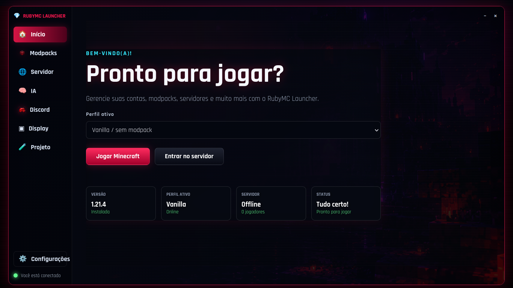
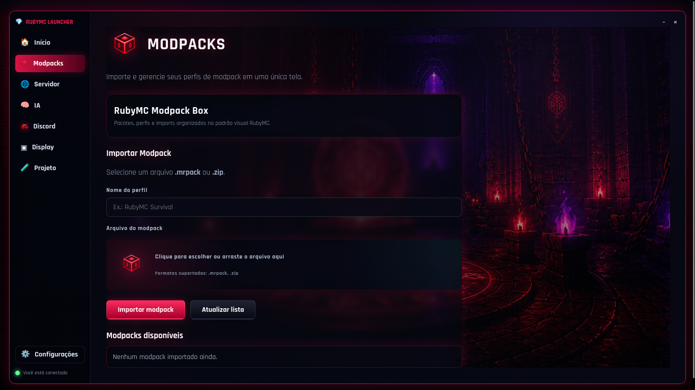
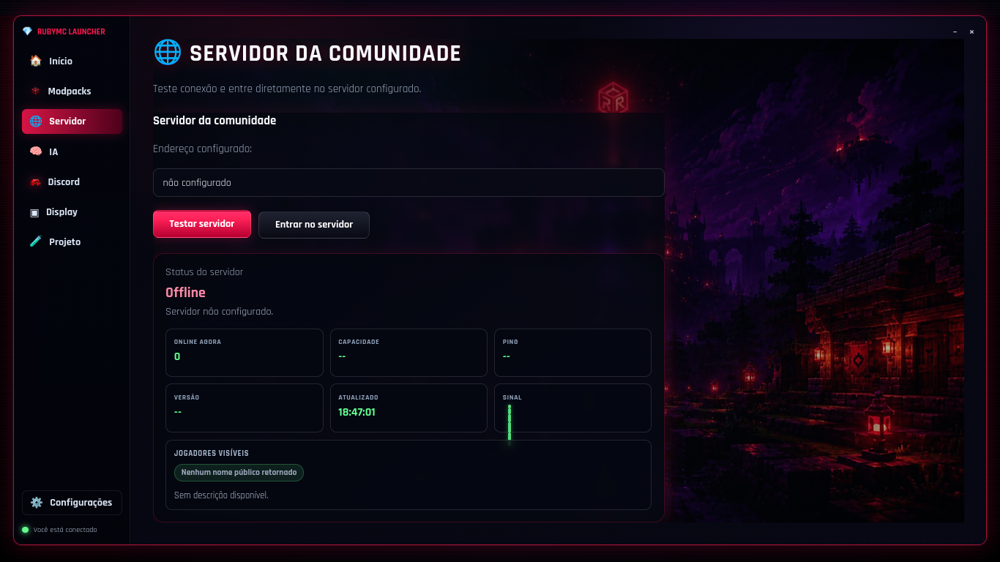
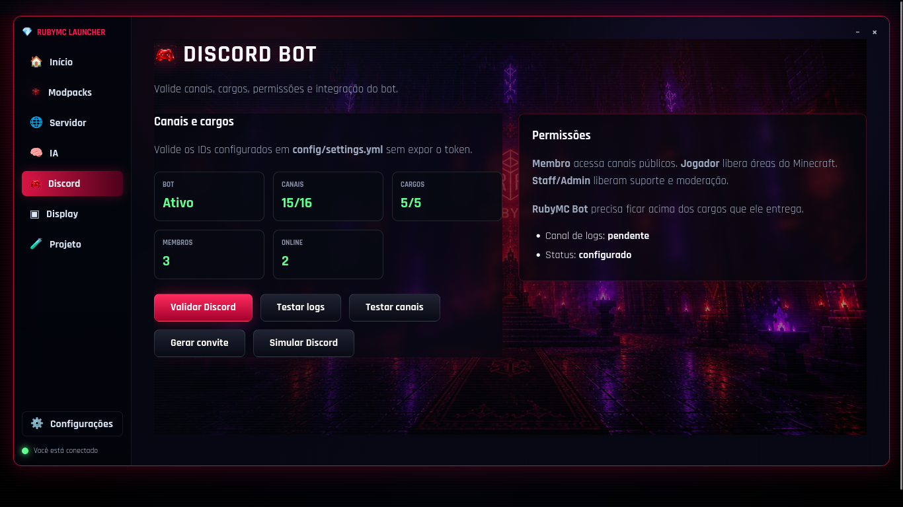
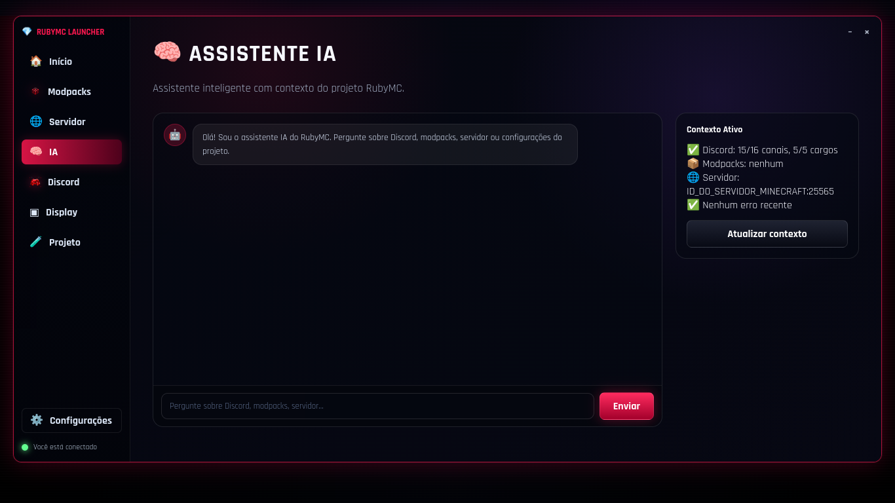
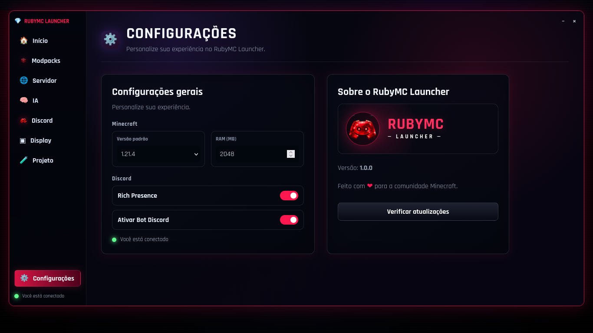

# 💎 RubyMC Java

<div align="center">


**Launcher Minecraft Java Edition com painel web, modpacks, autenticação Microsoft, bot Discord e IA local**

</div>

---

## 📋 Histórico de Alterações

### v1.2 — Gerenciamento Multi-Servidor

- **Gerenciamento de 9 servidores simultâneos** — `ServerManager` refatorado em `lib/rubymc/server_manager.rb` para suportar múltiplos servidores (realms, vanilla, forge, fabric, community, devlab, hardcore, arcade, bedrock). Cada servidor possui próprio JAR, mundo, configuração, PID independente e suporte aos tipos Java e Bedrock.
- **API REST multi-servidor** — `GET /api/servers` (lista), `POST /api/servers/start` com `{server_id}`, `POST /api/servers/stop` com `{server_id}`, `GET /api/servers/status` (status de todos). Permite controle individual de cada servidor.
- **Grid de servidores no painel** — `#server-grid` na aba Servidor com polling a cada 5s. Cartões individuais mostram nome, badge (Java/Bedrock), IP:porta, status 🟢/🔴 e botões Iniciar/Parar.
- **Painel antigo removido** — `#server-admin-panel` e `server-runtime-selector.js` substituídos pelo grid multi-servidor.
- **Comandos do bot Discord atualizados** — `!iniciar <id>`, `!parar <id>`, `!restart <id>`, `!log <id>`, `!backup <id>` aceitam ID do servidor (ex: `!iniciar vanilla`). `!servidores` lista todos com status.
- **Geração automática de `servers.dat`** — Novo `NBTWriter` em `lib/rubymc/nbt_writer.rb` escreve o arquivo NBT binário do Minecraft com todos os servidores do projeto antes de cada launch. O arquivo é gravado tanto em `~/.minecraft/` quanto no diretório personalizado do modpack (quando aplicável).
- **Download automático de server.jar** — `install_if_needed` baixa a versão Vanilla mais recente do manifest da Mojang quando o diretório do servidor não existe e `auto_install: true`.
- **Botão "Adicionar servidores ao Multiplayer"** — Membros podem adicionar todos os servidores da comunidade à própria lista Multiplayer do Minecraft com um clique, sem precisar iniciar o jogo. Ação disponível para role `:player`.

### v1.1.1 — Melhorias na UI e Correções

- **Imagens da barra lateral redimensionadas** — 10 PNGs em `web/assets/img/Sidebar/` reduzidas de ~1254×1254 para 40×40px via PIL LANCZOS (total ~20KB vs ~14MB original).
- **CSS `.nav-icon` atualizado** — `width` e `height` alterados de 28px para 40px em `web/assets/css/launcher.css`.
- **Link do Discord configurável** — URL do convite movida para `settings.yml discord.invite_url`. Botão no painel chama `handleDiscordServerJoin()`.
- **Card da comunidade reformulado** — banner 64px, avatar 56px, layout compactado.
- **Badges de cargos Ruby Packs** — 15 imagens de badge em `web/assets/img/ruby-packs/`. Exibidas na barra lateral, configurações e card de membro via `roleBadgeUrl()`.
- **Layout geral compactado** — padding do hero, títulos, estatísticas, cards, grid gap e msc-body reduzidos.
- **Instalador Fabric/Quilt** — tratativa de código de saída 1 (não zero) quando o JSON do loader já foi escrito.
- **Redirecionamento de stdout/stderr do Java** — saída do processo Minecraft capturada para `~/.minecraft/logs/launch-*.log`.
- **Classpath `-cp` automático** — adicionado aos argumentos JVM quando o JSON da versão omite a entrada.
- **Servidores da comunidade no `settings.yml`** — Lista de 9 servidores adicionada em `discord.servers` com configuração completa (id, name, address, type, dir, jar, java, memory, motd, online_mode, max_players, auto_install).

---

## 📸 Screenshots

<div align="center">

| 🏠 Dashboard | 📦 Modpacks |
|---|---|
|  |  |

| 🌐 Servidor | 💬 Discord |
|---|---|
|  |  |

| 🧠 IA | ⚙️ Configurações |
|---|---|
|  |  |

</div>

---

## 🚀 Funcionalidades

### Painel Web (Admin)

| Aba | Função |
|---|---|
| 🏠 **Dashboard** | Status geral, cards de estatísticas, ações rápidas, verificação de conta, validação Discord |
| 📦 **Modpacks** | Importar/remover modpacks `.mrpack` / `.zip` (Forge, Fabric, Quilt) |
| 🌐 **Servidor** | Status do servidor Minecraft em tempo real, MOTD, jogadores online |
| 💬 **Discord** | Validar bot, canais, cargos, testar canais, gerar convites |
| 🧠 **IA** | Chat com IA local via Ollama (Qwen 2.5 3B) |
| 📋 **Projeto** | Informações, scripts e ações do projeto |
| ⚙️ **Configurações** | Personalizar experiência do launcher |
| 📜 **Display** | Logs internos e ações do backend |

### Autenticação

- **Microsoft OAuth** — login real com conta Microsoft/Minecraft
- **Modo Offline** — jogar sem conta Microsoft (LAN/servidores offline)
- **Banco de Contas** — múltiplas contas com renovação automática de token

### Discord

- **Bot WebSocket** — daemon com boas-vindas automáticas, comandos slash, gerenciamento de cargos
- **Validação** — verifica bot, canais, cargos e logs pelo painel
- **Rich Presence** — status do jogo no Discord em tempo real via IPC local
- **Convites** — geração automática de convites com prazo de validade

### IA Local

- **Ollama** — modelo Qwen 2.5 3B (totalmente offline, sem necessidade de internet)
- **Interpretação de logs** — explica erros do Minecraft e sugere soluções
- **Suporte técnico** — responde dúvidas sobre configuração e modpacks

### Minecraft

- **Servidor da Comunidade** — status ao vivo com MOTD, jogadores online, versão e ping
- **Modpacks** — importação de `.mrpack` e `.zip` com criação automática de perfil
- **Simulação** — modo de teste com 20 jogadores simulados + Discord mock
- **Geração automática de `servers.dat`** — antes de cada launch, o launcher escreve o arquivo NBT do Minecraft com todos os servidores do projeto, tanto em `~/.minecraft/` quanto no diretório do modpack
- **Botão "Adicionar servidores ao Multiplayer"** — membros podem adicionar os servidores da comunidade à própria lista Multiplayer com um clique

### Gerenciamento Multi-Servidor

- **9 servidores simultâneos** — realms, vanilla, forge, fabric, community, devlab, hardcore, arcade e bedrock. Cada um com próprio JAR, mundo, configuração e PID independente.
- **Painel web** — grid com status em tempo real, badges Java/Bedrock, IP:porta e botões Iniciar/Parar para cada servidor.
- **API REST** — `GET /api/servers`, `POST /api/servers/start`, `POST /api/servers/stop`, `GET /api/servers/status` — controle individual por `server_id`.
- **Bot Discord** — comandos `!iniciar <id>`, `!parar <id>`, `!restart <id>`, `!log <id>`, `!backup <id>`, `!servidores`.
- **Auto-instalação** — servidores Vanilla baixam o `server.jar` automaticamente quando `auto_install: true`.

### Segurança

- ✅ **SSRF Protection** — downloads de URL bloqueiam IPs privados (127.0.0.1, 10.x, 172.16-31.x, 192.168.x)
- ✅ **Command Injection** — todos os comandos usam array-based execution (`Open3.capture3`, `system` com args separados)
- ✅ **Rate Limiting** — máximo de 16 threads simultâneas para bot, 32 para web
- ✅ **HMAC Sessions** — arquivos de sessão e verificação assinados com HMAC-SHA256 (chave derivada do `client_secret`)
- ✅ **OAuth State** — callback Microsoft e Discord incluem e validam parâmetro `state` (CSRF prevention)
- ✅ **Scheme Validation** — downloads rejeitam protocolos que não sejam `http://` ou `https://`

---

## 📋 Pré-requisitos

| Requisito | Mínimo | Verificação |
|---|---|---|
| **Ruby** | 3.0+ | `ruby --version` |
| **Bundler** | — | `gem install bundler` |
| **Java** | 21+ (para Minecraft 1.21.x) | `java --version` |
| **Ollama** (opcional) | — | `ollama pull qwen2.5:3b` |

---

## ⚙️ Instalação

```bash
# 1. Clone o repositório
git clone https://github.com/VICTORGG04/RubyMC-Launcher.git
cd RubyMC-Launcher/rubymc-java

# 2. Instale as dependências Ruby
bundle install

# 3. Crie o arquivo de configuração
cp config/settings.example.yml config/settings.yml

# 4. Edite config/settings.yml com suas informações
#    - Bot token do Discord (https://discord.com/developers/applications)
#    - Guild ID do seu servidor Discord
#    - IDs dos canais (welcome, logs, support)
#    - IDs dos cargos (member, player, staff, admin)

# 5. (Opcional) Configure a IA local
ollama pull qwen2.5:3b

# 6. Inicie
./rubymc start
```

Acesse o painel em **http://127.0.0.1:4567**

---

## 💻 CLI Admin (`./rubymc`)

### Comandos do Projeto

| Comando | Descrição |
|---|---|
| `./rubymc start` | Inicia servidor web + bot Discord + servidor Minecraft |
| `./rubymc start --simulate` | Modo simulação (20 jogadores + Discord mock) |
| `./rubymc start --no-servers` | Inicia sem servidor Minecraft |
| `./rubymc stop` | Para servidor Minecraft + web + bot |
| `./rubymc stop --keep-servers` | Para apenas web + bot, mantém servidor Minecraft |
| `./rubymc restart` | Reinicia tudo |
| `./rubymc status` | Status do projeto, bot e servidor |
| `./rubymc logs` | Logs da **web** (não do jogo) |
| `./rubymc test` | Verifica sintaxe Ruby (`server.rb`, `bot.rb`, `console.rb`, `web_launcher_app.rb`) + `bundle check` |
| `./rubymc install` | Instala dependências manualmente |
| `./rubymc classic` | Abre console Ruby clássico |

### Comandos do Servidor Minecraft

| Comando | Descrição |
|---|---|
| `./rubymc server start` | Inicia servidor Minecraft Java |
| `./rubymc server stop` | Para servidor Minecraft Java |
| `./rubymc server restart` | Reinicia servidor Minecraft Java |
| `./rubymc server status` | Status do servidor Minecraft |
| `./rubymc server logs` | Logs do servidor Minecraft |

### Comandos do Bot Discord

| Comando | Descrição |
|---|---|
| `./rubymc bot start` | Inicia bot Discord |
| `./rubymc bot stop` | Para bot Discord |
| `./rubymc bot restart` | Reinicia bot Discord |
| `./rubymc bot status` | Status do bot Discord |
| `./rubymc bot logs` | Logs do bot Discord |

### Comandos da IA

| Comando | Descrição |
|---|---|
| `./rubymc ai "sua pergunta"` | Pergunta única à IA |
| `./rubymc ai-chat` | Chat interativo com IA |

### Opções do `start` / `restart`

| Opção | Descrição |
|---|---|
| `--simulate` | Ativa modo simulação |
| `--no-servers` | Não inicia servidor Java junto |

### Variáveis de Ambiente

| Variável | Padrão | Descrição |
|---|---|---|
| `RUBYMC_HOST` | `127.0.0.1` | Host do servidor web |
| `RUBYMC_PORT` | `4567` | Porta do servidor web |
| `RUBYMC_AUTO_SERVERS` | `true` | Auto-start do servidor Java |
| `RUBYMC_SIMULATE` | — | Ativa modo simulação (`1`) |
| `RUBYMC_SERVER_DIR` | `~/Servidores/ServidorMinecraftJava` | Diretório do servidor Minecraft |
| `RUBYMC_GAME_LOG` | `$RUBYMC_SERVER_DIR/logs/latest.log` | Caminho do log do servidor Minecraft |

---

## 🎮 CLI Player (`bin/rubymc-player`)

```bash
bin/rubymc-player          # Menu interativo
bin/rubymc-player play     # Abre o launcher para jogar
bin/rubymc-player modpacks # Lista/instala modpacks instalados
bin/rubymc-player server   # Status do servidor da comunidade
bin/rubymc-player discord  # Exibe link do servidor Discord
bin/rubymc-player help     # Ajuda
```

---

## 🎭 Modo Simulação

Para testar o painel com dados simulados:

```bash
# Terminal 1: Inicia simulador de servidor Minecraft (20 jogadores online)
ruby bin/simulate_mc_players.rb

# Terminal 2: Launcher em modo simulação
RUBYMC_SIMULATE=1 ./rubymc start
```

Configure em `config/settings.yml`: `server_address: localhost:25566`

```bash
# Personalizar simulação (50 jogadores, porta 25567)
ruby bin/simulate_mc_players.rb --port 25567 --players 50 --max 100
```

---

## 🧠 IA Local (Ollama)

A IA usa **Ollama** com modelo local. Não requer internet.

```bash
# Instalar Ollama
curl -fsSL https://ollama.com/install.sh | sh

# Baixar modelo
ollama pull qwen2.5:3b

# Iniciar servidor Ollama
ollama serve
```

Configuração em `config/settings.yml`:

```yaml
ai_support:
  enabled: true
  provider: ollama
  host: http://127.0.0.1:11434
  model: qwen2.5:3b
  timeout_seconds: 300
  temperature: 0.35
  num_ctx: 8192
```

---

## 🏗️ Estrutura do Projeto

```
rubymc-java/
├── rubymc                      # CLI Admin (bash)
├── Gemfile                     # Dependências Ruby
├── Gemfile.lock
│
├── app/                        # Entry points
│   ├── server.rb               # Servidor web (Sinatra/WEBrick)
│   ├── bot.rb                  # Bot Discord (WebSocket Gateway)
│   └── console.rb              # Launcher clássico (terminal)
│
├── bin/                        # Ferramentas
│   ├── rubymc-player           # CLI Player (terminal)
│   ├── simulate_mc_players.rb  # Simulador de servidor Minecraft
│   └── run_checks.rb           # Verificações pré-execução
│
├── lib/                        # Módulos principais
│   ├── web_launcher_app.rb     # App WEBrick (painel admin)
│   ├── account_bank.rb         # Banco de contas Microsoft
│   ├── discord_integration.rb  # Rich Presence + convites
│   └── rubymc/
│       ├── ai_cli.rb           # CLI da IA
│       ├── ai_support_service.rb # Serviço de IA (Ollama)
│       ├── auto_updater.rb     # Auto-updater
│       ├── discord_bot_service.rb # Bot Discord (commands, events)
│       ├── discord_config.rb   # Configuração do Discord
│       ├── launcher_cli.rb     # Lógica do CLI Player
│       ├── microsoft_auth.rb   # Autenticação Microsoft OAuth
│       ├── minecraft_manager.rb # Gerenciamento de instâncias
│       ├── minecraft_server_status.rb # Status do servidor
│       ├── modpack_manager.rb  # Gerenciamento de modpacks
│       ├── rubymc_bot_config_bridge.rb # Bridge bot-config
│       ├── rubymc_discord_panel_actions.rb # Ações do painel Discord
│       ├── rubymc_settings.rb  # Gerenciamento de configurações
│       ├── nbt_writer.rb       # Escrita NBT para servers.dat
│       ├── server_manager.rb   # Gerenciamento multi-servidor
│       └── server_version_manager.rb # Versões do servidor
│
├── config/
│   ├── settings.yml            # Configuração (gitignorado)
│   └── settings.example.yml    # Exemplo público
│
├── web/                        # Frontend
│   ├── index.html              # Página principal do painel
│   ├── termos.html             # Termos de uso
│   └── assets/
│       ├── css/
│       │   ├── launcher.css    # Estilos principais
│       │   ├── server-java-page.css
│       │   └── bedrock-download-fix.css
│       ├── js/
│       │   ├── launcher.js     # Lógica do painel
│       │   ├── rubymc-ai-support.js
│       │   ├── server-runtime-selector.js
│       │   └── utils.js
│       └── img/                # Imagens e backgrounds
│
├── archive/scripts/            # Scripts auxiliares legados
├── docs/                       # Documentação
│   └── assets/screenshots/     # Screenshots do painel
│
└── tmp/                        # Runtime (gitignorado)
    └── rubymc/
        ├── web.pid
        ├── web.log
        ├── bot.pid
        └── bot.log
```

---

## 🔧 Configuração (`config/settings.yml`)

```yaml
discord:
  rich_presence: true
  bot_enabled: true
  bot_token: "seu_bot_token"
  client_id: "seu_client_id"
  client_secret: "seu_client_secret"
  guild_id: "id_do_servidor"
  server_address: "ip:porta"
  invite_url: "https://discord.gg/seuconvite"

  channels:
    welcome_channel_id: "..."
    support_channel_id: "..."
    logs_channel_id: "..."

  roles:
    member_role_id: "..."
    player_role_id: "..."
    staff_role_id: "..."
    admin_role_id: "..."
    bot_role_id: "..."

  servers:
    - id: realms
      name: Ruby Realms
      address: 192.168.0.9:25565
      description: Servidor principal
      type: java
      dir: "/caminho/para/servidor"
      jar: server.jar
      java: "/usr/lib/jvm/java-21/bin/java"
      memory: "-Xmx4G -Xms2G"
      motd: "§c§lRubyMC Servidor"
      online_mode: true
      max_players: 20
      auto_install: true

ai_support:
  enabled: true
  provider: ollama
  host: http://127.0.0.1:11434
  model: qwen2.5:3b
  timeout_seconds: 300
  temperature: 0.35
  num_ctx: 8192

servers:
  java:
    active_version: 26.1.2
    active_loader: vanilla
    active_jar: "/caminho/para/server.jar"
    active_java: "/usr/lib/jvm/java-21-openjdk-amd64/bin/java"
    memory: "-Xmx2G -Xms1G"
    motd: "§c§lRubyMC §8▪ §6§lServidor Java"
```

> **⚠️ Segurança:** `config/settings.yml` está no `.gitignore`. Nunca commite tokens reais.

---

## 🛠️ Validação

```bash
# Verificar sintaxe
ruby -c app/server.rb
ruby -c app/bot.rb
ruby -c app/console.rb
ruby -c lib/web_launcher_app.rb

# Verificar dependências
bundle check

# Teste completo
./rubymc test
```

---

## 🗺️ Roadmap

### ✅ v1.1 (atual)
- [x] Autenticação Microsoft OAuth com banco de contas
- [x] Modo offline (LAN/servidores offline)
- [x] Suporte a modpacks (`.mrpack` / `.zip`)
- [x] Servidor da comunidade com status ao vivo (MOTD, jogadores, ping)
- [x] Discord Bot (WebSocket: boas-vindas, comandos slash, cargos, convites)
- [x] Rich Presence no Discord
- [x] IA local via Ollama (Qwen 2.5 3B)
- [x] Dashboard consolidado com glassmorphism e animações
- [x] CLI Admin (`./rubymc`) com todos os comandos
- [x] CLI Player (`bin/rubymc-player`)
- [x] Modo simulação (20 jogadores + Discord mock)
- [x] Segurança: SSRF, command injection, rate limiting, HMAC, OAuth state

### ✅ v1.2 — Gerenciamento Multi-Servidor e UI
- [x] Gerenciamento de 9 servidores simultâneos (realms, vanilla, forge, fabric, community, devlab, hardcore, arcade, bedrock)
- [x] API REST multi-servidor + grid no painel web com status em tempo real
- [x] `servers.dat` gerado automaticamente via NBTWriter antes de cada launch
- [x] Botão "Adicionar servidores ao Multiplayer" para membros (role player)
- [x] Bot Discord com comandos multi-servidor (`!iniciar <id>`, `!parar <id>`, etc.)
- [x] Badges de cargos Ruby Packs (15 imagens)
- [x] Imagens da barra lateral redimensionadas para 40×40px
- [x] Link do Discord configurável via `settings.yml`
- [x] Layout compactado e card da comunidade reformulado
- [x] Auto-instalação de server.jar (Vanilla)

### 🔜 v1.3
- [ ] IA premium (OpenAI/Anthropic)
- [ ] Integração Modrinth/CurseForge API
- [ ] Autenticação de usuários no painel
- [ ] Auto-detect de versões Java
- [ ] Empacotamento `.deb` / `.AppImage`

---

## 📄 Licença

Este projeto está licenciado sob a **MIT License** — consulte o arquivo [LICENSE](../LICENSE) para detalhes.

---

## 👨‍💻 Autor

Desenvolvido por **Victor Marcial**.
